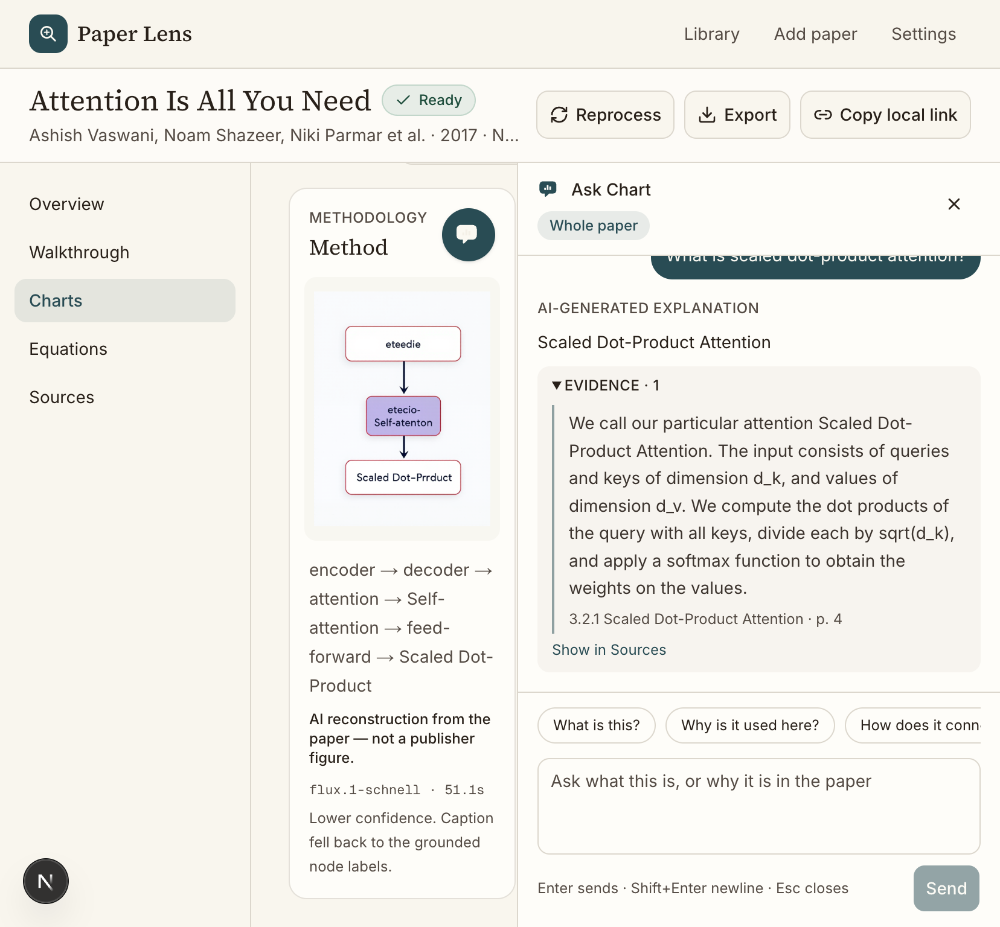
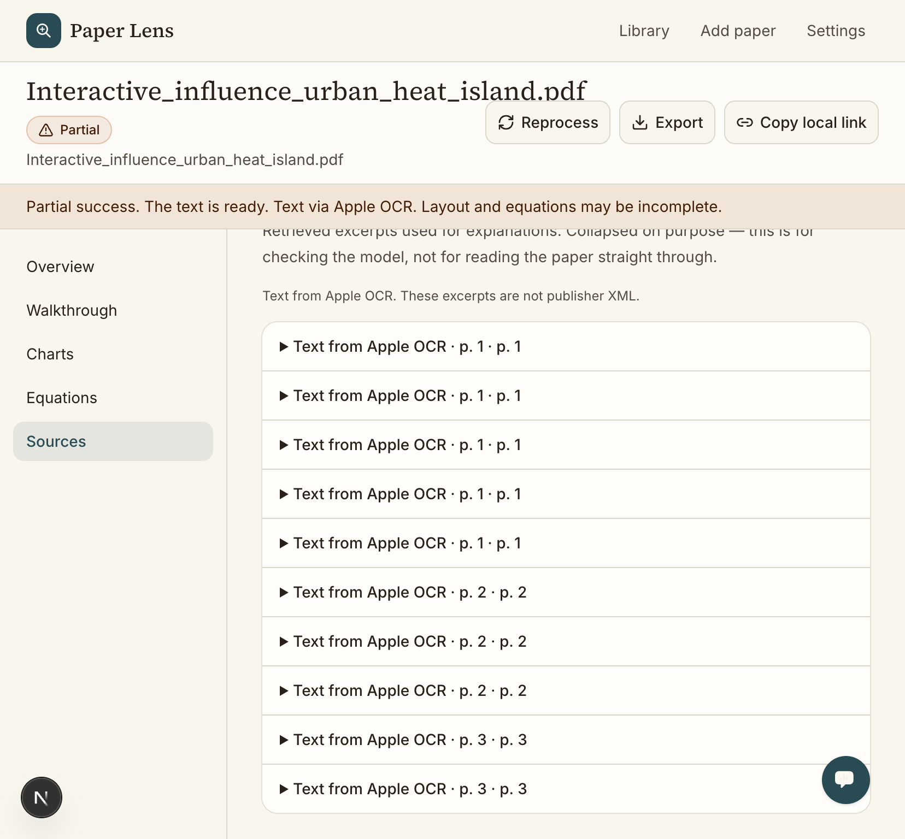
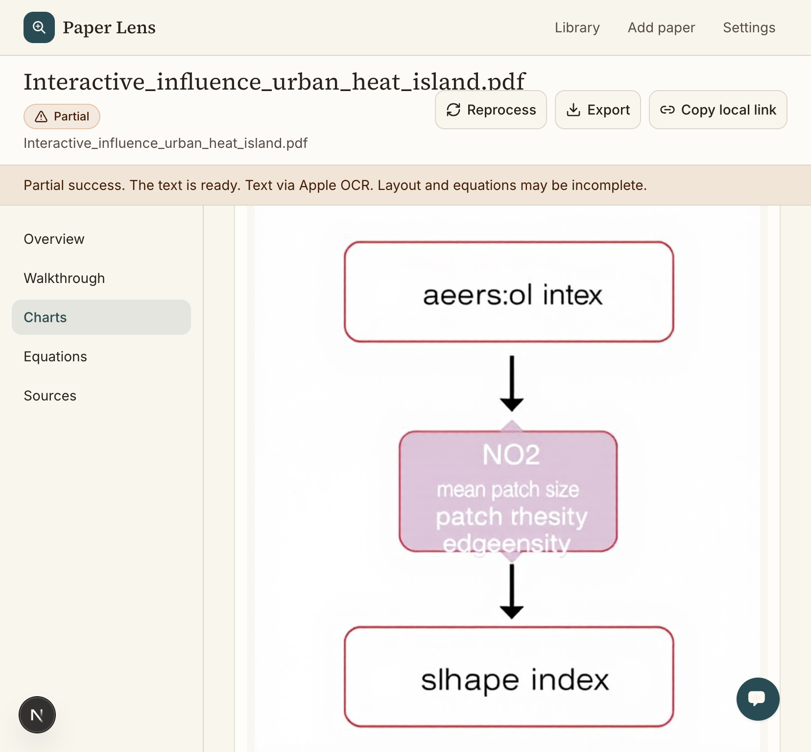

# Paper Lens

A reading desk for research papers. Upload a PDF or paste an arXiv, IEEE, or Springer link, then read a plain-language walkthrough, reconstructed charts, and an equation table. Ask Chart answers from retrieved excerpts of that paper only.

This repository is a local reading desk for Apple Silicon. Mock mode uses stored excerpts and bundled diagrams. With mock mode off, a Mac reads PDFs with Apple OCR, embeds with `nomic-embed-text`, answers with `llama3.2:3b`, and draws methodology charts with FLUX.1 schnell. Those heavy steps never run together. Nothing here calls a cloud model.

## Run locally

```bash
npm install
npm run dev
```

The dev server in this environment is started on port **43123**. Locally, `npm run dev` uses Next.js’s default port unless you pass one:

```bash
npx next dev --turbopack -H 0.0.0.0 -p 43123
```

Open [http://127.0.0.1:43123](http://127.0.0.1:43123).

## Results

Live desk on an Apple Silicon Mac, mock mode off. These are screenshots from that run, not mock diagrams.

**Attention Is All You Need.** Regenerate built one methodology chart with FLUX.1 schnell in 51.1s. The labels under the figure are the grounded spans: encoder, decoder, attention, Self-attention, feed-forward, Scaled Dot-Product. Ask answered from a retrieved excerpt (section 3.2.1, page 4).



**Apple OCR.** A dropped IEEE PDF (urban heat islands, Delhi and Bangalore) stayed Partial. Sources are labeled “Text from Apple OCR.”



Regenerate then drew a methodology chart from method terms in that OCR text: aerosol index, NO2, mean patch size, edge density, shape index.



Letters inside the pictures are FLUX’s rendering of those labels. A label that is not in the cited excerpt is not added.

## What you can click through

The library starts with three items:

| Paper | What the demo does |
| --- | --- |
| Attention Is All You Need (`arXiv:1706.03762`) | Full walkthrough, seven equations, Ask Chart. With mock mode off, Regenerate replaces the methodology chart with a FLUX image |
| BERT (`arXiv:1810.04805`) | Walkthrough only. Equation parse and charts fail on purpose |
| Example IEEE link | Paywall. No abstract or explanation is invented |

On **Add paper**, try:

- `https://arxiv.org/abs/1706.03762`
- `https://arxiv.org/abs/1810.04805`
- any `ieeexplore.ieee.org` or Springer URL (paywall message)
- a PDF. On a Mac with mock mode off and Apple OCR on, the file is Partial and sources say “Text from Apple OCR.” Otherwise it stays Not parsed and shows the bundled Transformer sample

`/` focuses Ask. Esc closes the drawer.

## Charts and Ask on a 24 GB M4 Pro

Mock mode on (the default) does not call a model. The Transformer charts are the bundled Mermaid reconstruction. Ask uses the stored notes.

Mock mode off, on Apple Silicon, loads one heavy model at a time. Peak target is under 18 GB so macOS keeps headroom on a 24 GB machine.

1. Regenerate reads method excerpts already in the paper (parsed text, or Apple OCR text that names a method). Labels are verbatim spans from those excerpts. A label that is not in the cited excerpt is dropped.
2. The desk asks Ollama to unload chat and embedding models (`keep_alive: 0`).
3. `scripts/flux_render.py` runs in its own process, loads only FLUX.1 schnell via mflux (4-bit, low-ram flags when the CLI supports them), writes a PNG under `public/generated/`, and exits. That exit unloads FLUX before Ask.
4. If FLUX is missing or fails, the card shows Mermaid from those same labels and says FLUX was unavailable. If the method text is too thin, Regenerate keeps the last chart and says nothing was invented.
5. Ask indexes chunks with `nomic-embed-text`, then answers with `llama3.2:3b` from the retrieved excerpts only. Empty retrieval is a refusal. Settings can switch Ask to `gemma2:2b` when that tag is already installed. It is not the default, and setup does not pull it.

No vision-language model is required for charts or Ask.

| Role | Id | Notes |
| --- | --- | --- |
| PDF text | Apple Vision | macOS only. Sources say “Text from Apple OCR.” |
| Render | `flux.1-schnell` | mflux name `schnell`, quantize 4. Own process. Weights stay in the Hugging Face cache. |
| Render, optional | `flux.2-klein` | Used only when that checkpoint is already installed. |
| Embeddings | `nomic-embed-text` | Ollama. Unloaded before FLUX. |
| Ask | `llama3.2:3b` | Ollama. Default. Loaded only after FLUX has exited. |
| Ask, optional | `gemma2:2b` | Settings only. Not pulled by `setup_mac.sh`. |

```bash
uv tool install mflux
ollama pull nomic-embed-text
ollama pull llama3.2:3b
```

FLUX.1 schnell is expected to already be in `~/.cache/huggingface/hub`. This repo does not download it.

```bash
PAPER_LENS_MOCK=0
PAPER_LENS_FLUX_MODEL=flux.1-schnell
PAPER_LENS_EMBED_MODEL=nomic-embed-text
PAPER_LENS_ASK_MODEL=llama3.2:3b
PAPER_LENS_RAM_BUDGET_GB=18
```

Partial, paywalled, failed, and Not parsed papers never start this pipeline. OCR text without method cues does not get a chart.

On the Mac, from the repo root:

```bash
cp .env.example .env.local
bash scripts/setup_mac.sh
npm install
npx next dev --turbopack -H 0.0.0.0 -p 43123
```

`scripts/setup_mac.sh` creates `.venv`, checks that `mflux-generate` is installed, confirms FLUX.1 schnell is already under `~/.cache/huggingface/hub` (it does not download the weights), and pulls `nomic-embed-text` plus `llama3.2:3b`. Next spawns `.venv/bin/python` when that file exists, or `PAPER_LENS_PYTHON` if you set it. `PAPER_LENS_MOCK=0` turns mock mode off on the first visit, before a choice is saved in the browser.

## Apple OCR

With mock mode off and **Apple OCR for PDFs** on, a dropped PDF is rendered and read by Apple Vision (`scripts/apple_ocr.swift`, called from `scripts/apple_ocr.py`). Sources are labeled “Text from Apple OCR.” The paper stays Partial: equations are not recovered, and charts stay empty unless that text names a method, in which case Regenerate builds a FLUX prompt from those excerpts. There is no cloud OCR.

Mock mode on does not call OCR. A paywalled link with no PDF still has no invented abstract. On Linux or any non-Mac host, OCR refuses and the upload stays Not parsed, showing the bundled sample instead of made-up text.

The endpoint and API key in Settings stay disabled. Keys already in `localStorage` under `paper-lens-settings` are not sent.

## API surface

UI code talks to `PaperLensClient` in `src/lib/api/client.ts`:

- `listPapers`
- `getPaper` / `getWalkthrough` / `getEquations` / `getCharts`
- `ingest`
- `reprocess`
- `ask` (scoped to the whole paper, one equation, or one chart; streams tokens)
- `POST /api/charts` — Ready papers, or Partial papers from Apple OCR; method text, then FLUX in its own process
- `POST /api/index` — embed chunks for one paper
- `POST /api/ask` — answer from retrieved chunks, or refuse

The mock lives in `src/lib/paper-store.ts` and `src/lib/mock/`. Explanations are written against excerpt ids. If an answer has no excerpt, the client refuses instead of filling the gap.

Replace `createPaperLensClient` with a network implementation when the RAG worker exists. Keep the same types in `src/lib/api/types.ts`.

## Layout

See `DESIGN.md`. No wireframe was attached, so the layout follows the brief: library, ingest, paper workspace (overview, walkthrough, charts, equations, sources, ask drawer), and settings.
